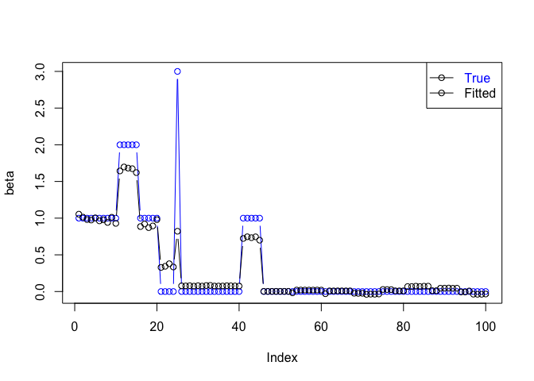

<!-- README.md is generated from README.Rmd. Please edit that file -->
neggfl
======

Implementation of fused lasso regression modeling with NEG prior distribution.

Installation
------------

Or for the latest development version:

``` r
devtools::install_github("ksmstg/neggfl") 
```

Example
-------

This is a basic example which shows you how to solve a common problem:

``` r
library("neggfl")

# 1. Data setting ---------------------------------------------------------

n=500
p=100

# 2. Generate data. -------------------------------------------------------

beta=rep(0,p)
beta[ 1:20]  = 1
beta[11:15]  = 2
beta[25]     = 3
beta[41:45 ] = 1
x=matrix(rnorm(n*p),n,p)
y=x%*%beta+rnorm(n,0,0.5)

# 3. Set hyperparameter. --------------------------------------------------

lambda2=7500.0
gamma2=0.5

# 4. Execute --------------------------------------------------------------

mod <- negfl(x, y, lambda2=lambda2, gamma2=gamma2, maxiter=5e3, burnin=2e3)
ic <- ebic(x, y, mod$beta, mod$sigma2)

plot(beta,col="blue",type="b",pch=1,ylim=range(beta, mod$beta))
lines(mod$beta, type="b",lty=1,col="black")
legend("topright",pch=1,lty=1,merge=TRUE,text.col=c("blue","black"),legend=c("True","Fitted"))
```


